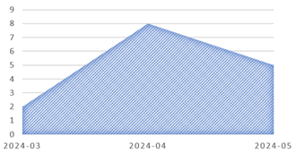

# Appointment Growth Analysis

## Objective

Analyse month-to-month appointment volumes and calculate the change in appointment numbers between consecutive months.

## SQL Query

```sql
-- Can we see the growth in appointment numbers from month to month?

WITH MonthlyAppointments AS (
    SELECT 
          DATE_FORMAT(AppointmentDate,'%Y-%m') AS Month, 
		  COUNT(AppointmentID) AS AppointmentCount
    FROM AppointmentDetails
    GROUP BY Month
)
SELECT Month, AppointmentCount,
       AppointmentCount - LAG(AppointmentCount) OVER (ORDER BY Month) AS Growth
FROM MonthlyAppointments;
```

## Output



## Insight

The analysis shows appointment volume increasing from 2 appointments in March 2024 to 8 in April, followed by a decrease to 5 appointments in May. This represents a growth of 6 appointments from March to April, followed by a decline of 3 appointments from April to May.
