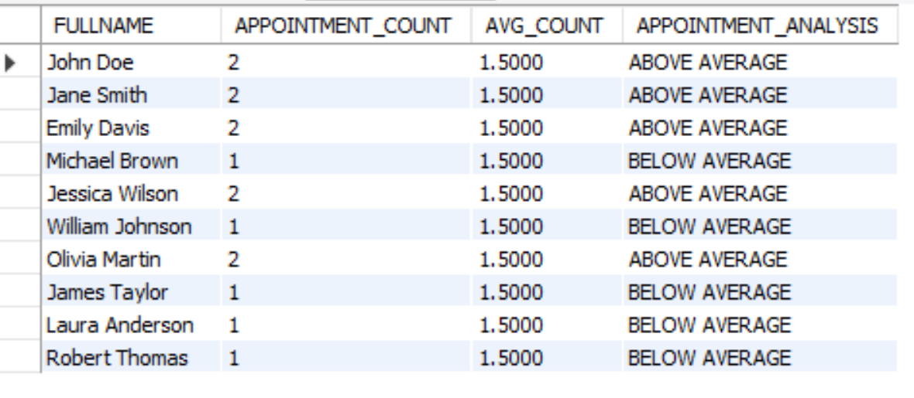

# Patient Engagement Analysis

## Objective

Compare each patient's appointment count with the clinic's average appointment count to identify patients with above-average, below-average, or average appointment engagement.

## SQL Query

```sql
-- How does each patient's appointment count compare to the clinic's average?

WITH APPOINTMENTCOUNTS AS (
    SELECT 
        PATIENTID,
        COUNT(APPOINTMENTID) AS APPOINTMENT_COUNT
    FROM APPOINTMENTDETAILS
    GROUP BY PATIENTID
),

CLINICS_AVERAGE AS (
    SELECT 
        AVG(APPOINTMENT_COUNT) AS AVG_COUNT
    FROM APPOINTMENTCOUNTS
)

SELECT 
    P.FULLNAME,
    AC.APPOINTMENT_COUNT,
    CA.AVG_COUNT,
    CASE
        WHEN AC.APPOINTMENT_COUNT > CA.AVG_COUNT 
            THEN 'ABOVE AVERAGE'
        WHEN AC.APPOINTMENT_COUNT < CA.AVG_COUNT 
            THEN 'BELOW AVERAGE'
        ELSE 'AT PAR'
    END AS APPOINTMENT_ANALYSIS
FROM APPOINTMENTCOUNTS AC
JOIN PATIENTS P 
    ON AC.PATIENTID = P.PATIENTID
CROSS JOIN CLINICS_AVERAGE CA;
```

## Output



## Insight

The clinic's average appointment count is 1.5 appointments per patient. The analysis shows an even split, with five patients recording two appointments and five recording one appointment. No patient falls exactly at the clinic average.
