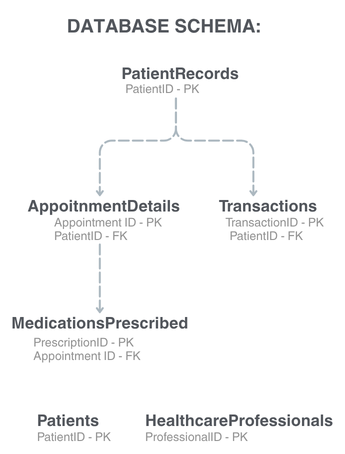

# Healthcare Analytics using SQL

## Project Overview

This project demonstrates SQL-based analysis using a relational healthcare database designed to simulate day-to-day healthcare operations. The database was created from scratch and includes patients, appointments, healthcare professionals, medications, transactions, and patient records.

The project focuses on designing a relational database, querying data using SQL, and extracting meaningful insights from healthcare operations. It demonstrates the practical application of SQL for data retrieval, aggregation, joins, subqueries, Common Table Expressions (CTEs), and window functions.

## Project Objective

Design and analyse a relational healthcare database using SQL to uncover patient trends, appointment patterns, medication usage, healthcare professional performance, and revenue insights while demonstrating core SQL concepts used in data analysis.

## Database Overview

The Healthcare Analytics database consists of six interconnected tables representing key aspects of healthcare operations. The relational structure enables efficient storage, retrieval, and analysis of patient, appointment, medication, and financial data.

| Table | Description |
|--------|-------------|
| Patients | Stores patient demographic information. |
| PatientRecords | Contains patient diagnoses, treatment details, and medical history. |
| AppointmentDetails | Records appointment dates, departments, doctors, and visit status. |
| HealthcareProfessionals | Stores information about healthcare providers and their specialisations. |
| MedicationsPrescribed | Tracks medications prescribed to patients during treatment. |
| Transactions | Records billing, payment methods, and transaction details. |

## Database Schema

The Entity Relationship (ER) Diagram below illustrates the structure of the Healthcare Analytics database, including the relationships between tables, primary keys (PK), and foreign keys (FK). It provides a visual representation of the relational database design used throughout this project.

## Project Workflow

The project follows a structured workflow, beginning with database design and ending with analytical insights generated through SQL queries.

Database Design  
↓  
Table Creation  
↓  
Data Insertion  
↓  
SQL Query Execution  
↓  
Data Analysis  
↓  
Key Findings

## SQL Concepts Used

This project demonstrates the practical application of fundamental and intermediate SQL concepts for querying and analysing relational healthcare data.

- SELECT
- WHERE
- ORDER BY
- GROUP BY
- Aggregate Functions
- INNER JOIN
- LEFT JOIN
- Subqueries
- Common Table Expressions (CTEs)
- Window Functions

## Key Findings

The SQL analysis provided insights into multiple aspects of healthcare operations, including:

- Identified patient appointment trends across different departments.
- Analysed healthcare professional activity and appointment distribution.
- Examined medication prescription patterns.
- Evaluated revenue generated through healthcare transactions.
- Retrieved patient medical records for treatment analysis.
- Applied SQL joins, aggregations, subqueries, CTEs, and window functions to answer analytical business questions.

> **Note:** The complete SQL queries and outputs are available in the `Healthcare_Analytics_Database.sql` file.
